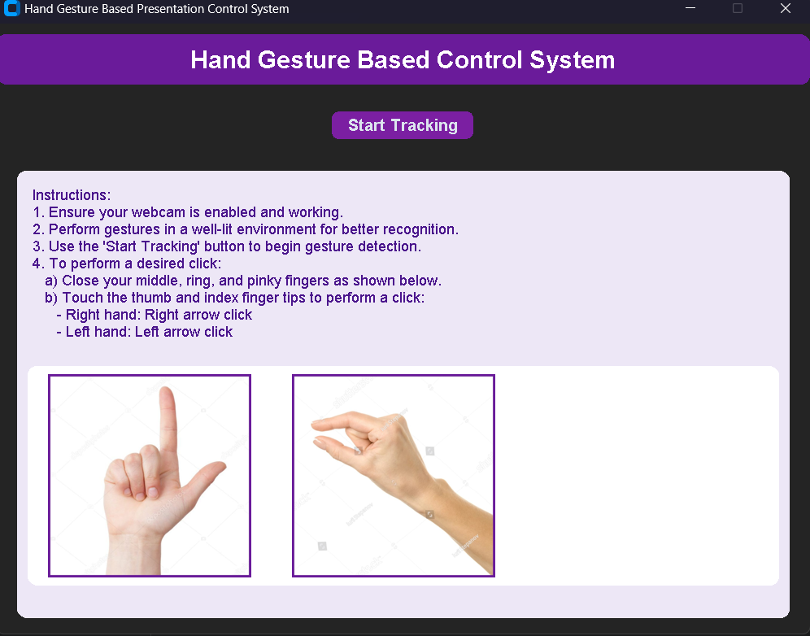
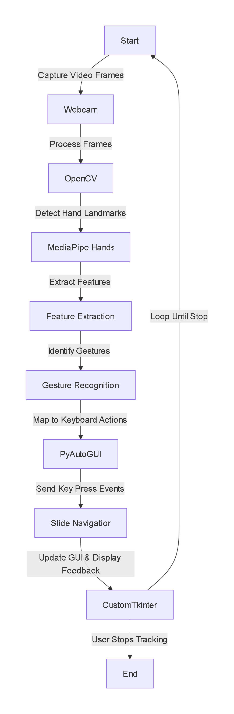

# Hand Gesture Based Presentation Control System
 

A Python-based desktop application that allows you to control presentations (like PowerPoint, Keynote, or Google Slides) using hand gestures. By leveraging computer vision and hand-tracking algorithms, this system maps specific hand movements to keyboard events, enabling a seamless, touch-free presentation experience.

## Features

* **Real-Time Hand Tracking:** Utilizes MediaPipe and OpenCV for highly accurate and fast hand landmark detection.
* **Intuitive Gestures:**
* Use your **Right Hand** to advance to the next slide (Right Arrow).
* Use your **Left Hand** to go back to the previous slide (Left Arrow).


* **Modern User Interface:** Built with CustomTkinter for a sleek, responsive, and user-friendly dark-mode GUI.
* **Smooth Performance:** Runs the computer vision backend on a separate thread to ensure the UI remains responsive.
* **Visual Feedback:** Displays real-time webcam feed with landmark connections, gesture states ("Locked" / "Not Locked"), and visual "CLICKED" confirmations.

---

## Architecture Diagram

The system follows a straightforward pipeline from video capture to GUI updates:
 
---

## Directory Structure

```text
└── Hand Gesture Based Presentation Control System/
    ├── Backend.py          # Core computer vision & gesture recognition logic
    ├── GUI.py              # CustomTkinter user interface and threading setup
    ├── diagram.mmd         # Mermaid architecture diagram
    ├── main.py             # Entry point for the application
    ├── requirements.txt    # Python dependencies
    └── res/                # Resource folder containing instruction images
        ├── img1.jpg
        └── img2.jpg

```

---

## Prerequisites

* **Python 3.10** *(Note: This project was specifically built and tested using Python 3.10)*
* A working webcam

## Installation

1. **Clone the repository** (or download the source code):
```bash
git clone https://github.com/SIDD-KIDD/Hand-Gesture-Based-Presentation-Control-Systen
cd "Hand Gesture Based Presentation Control System"
```

2. **Create a Virtual Environment (Recommended):**
```bash
python -m venv venv
source venv/bin/activate  # On Windows use: venv\Scripts\activate
```

3. **Install Dependencies:**
```bash
pip install -r requirements.txt
```

---

## Usage

1. **Launch the application:**
```bash
python main.py
```

2. **Start Tracking:** Click the **"Start Tracking"** button in the GUI. The application will request access to your webcam.
3. **Perform Gestures:**
* **Step 1: Lock the Gesture**
Close your middle, ring, and pinky fingers. Leave your thumb and index finger open. The screen will display **"Gesture Locked"** in green.
 

* **Step 2: Click/Trigger**
Pinch your thumb and index finger together (bringing the normalized distance below 0.2).

 
* **Navigation:**
* Doing this with your **Right Hand** simulates a `Right Arrow` key press (Next Slide).
* Doing this with your **Left Hand** simulates a `Left Arrow` key press (Previous Slide).


4. **Stop Tracking:** Click **"Stop Tracking"** to safely release the webcam and return to the instruction screen, or simply close the window.

---

## Key Dependencies
All the below libs will be downloaded automatically.

* **OpenCV (`opencv-python`)**: For capturing webcam frames and rendering visual feedback.
* **MediaPipe (`mediapipe`)**: Google's framework used for detecting and tracking hand landmarks in real-time.
* **PyAutoGUI (`PyAutoGUI`)**: For programmatically triggering keyboard events.
* **CustomTkinter (`customtkinter`)**: For building the modern, dark-themed graphical user interface.